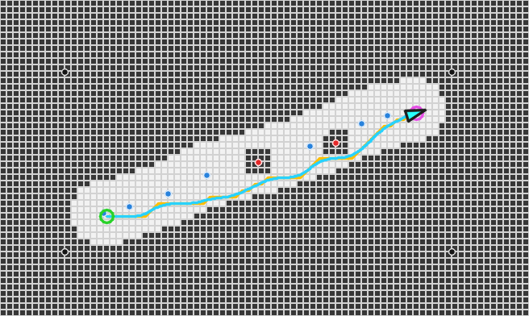
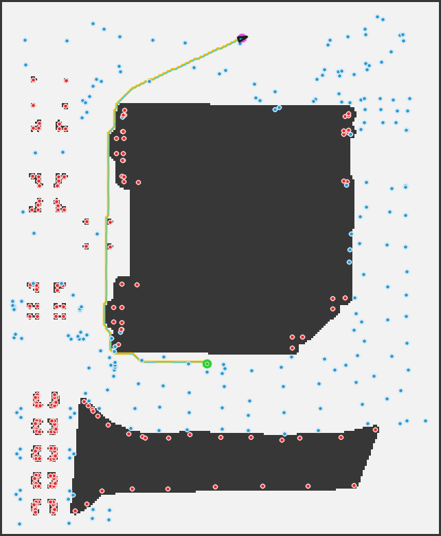
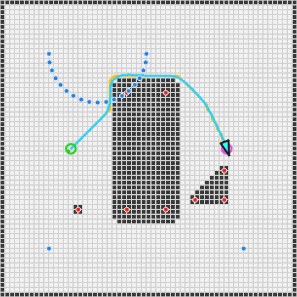

# RTK-Navigation-System

`RTK-Navigation-System` 是一个基于 C++17 的 RTK / GNSS 导航系统仿真项目。

项目目标不是做一个简单的路径规划 demo，而是模拟真实导航系统中的一条核心流程：将测量得到的地理坐标数据转换为机器人或自动驾驶车辆可使用的局部地图，并在地图上完成路径规划与车辆导航可视化。

## 项目流程

```text
RTK / GNSS 测量数据
        -> 坐标转换
        -> 局部地图生成
        -> 占据栅格地图
        -> A* 全局路径规划
        -> 车辆导航可视化
```

项目从 WGS84 经纬高数据开始，将其转换为本地 ENU 米制坐标系，再生成 Occupancy Grid Map，最后使用 A* 规划路径，并通过 OpenCV 显示车辆沿路径运动的过程。

## 效果展示

### WGS84 示例数据导航

程序读取带有道路、障碍物、边界、起点和终点标签的示例 RTK 数据，完成 ENU 坐标转换、栅格建图、A* 路径规划和车辆跟踪。



### 华测/CASS 实测数据导航

程序读取华测 RTK 导出的 CASS DAT 平面坐标，排除远处基站记录，并基于测区地物轮廓生成近似占据地图。图中深色区域为建筑、水域和绿化障碍，黄色为 A* 路径，青色为车辆跟踪轨迹。



### 通用 DXF 导航

程序读取 ASCII DXF 中的图层和几何实体，根据 YAML 图层规则识别建筑、道路、水域、植被和围墙，再自动生成占据地图和导航路径。



## 技术栈

- C++17
- CMake
- OpenCV
- Eigen


## 构建项目

```bash
cmake -S . -B build
cmake --build build
```

## 运行项目

打开 OpenCV 动画窗口：

```bash
./build/RTK-Navigation-System
```

如果当前环境看不到 OpenCV 窗口，可以使用无窗口模式，只保存结果图：

```bash
./build/RTK-Navigation-System --no-gui
```

默认输出图片：

```text
output/navigation_result.png
```

指定自定义 CSV 输入和输出图片：

```bash
./build/RTK-Navigation-System --csv data/rtk_points.csv --output output/navigation_result.png
```

### 运行华测/CASS DAT 实测数据

项目支持直接读取华测 RTK 导出的 CASS 平面坐标 DAT：

```bash
./build/RTK-Navigation-System \
  --cass 海资.dat \
  --start-id I51 \
  --goal-id I73 \
  --no-gui
```

默认输出：

```text
output/cass_navigation_result.png
```

DAT 格式：

```text
点号,编码,平面坐标1,平面坐标2,高程
I51,,394058.561,3418949.061,18.236
```

真实数据模式会：

- 自动排除距离测区过远的基站记录
- 直接使用已有平面坐标，不再执行 WGS84 到 ENU 转换
- 将测区最小坐标作为局部地图原点
- 根据指定点号设置导航起点和终点
- 生成占据栅格、A* 路径和车辆轨迹

当前对 `海资.dat` 的试验性分类规则：

- `B` 点组：海资楼建筑轮廓，填充为障碍物
- `R` 点组：水域轮廓，填充为障碍物
- `F` 点组：左侧绿化或小型构筑物，按测点附近障碍处理
- 其他点组：作为测量参考点显示，不直接判断为障碍物

这套分类依据现有 CASS 地形图人工确认，属于近似地图。后续如果提供 DXF 图层，可以替换为按 CASS 图层自动识别地物。

### 通用 DXF 导航架构

项目已经加入与具体测区无关的 DXF 地图处理层：

```text
DXF geometry
    -> MapFeature
    -> LayerConfig
    -> feature classification
    -> FeatureMapBuilder
    -> Occupancy Grid
    -> A*
    -> vehicle navigation
```

核心模块：

- `MapFeature`：统一表示点、折线和闭合多边形
- `LayerConfig`：通过 YAML 配置图层语义和占据规则
- `FeatureMapBuilder`：将通用地物生成占据栅格
- `DxfReader`：读取 ASCII DXF 几何和图层

图层配置文件：

```text
config/dxf_layers.yaml
```

配置示例：

```yaml
rules:
  - layers: [ "BUILDING", "JZW", "房屋", "建筑" ]
    match: "exact"
    semantic: "building"
    occupancy: "occupied"
    force_closed: 1
    inflation: 1.5
    line_width: 0.3
```

未来通用运行接口已经固定为：

```bash
./build/RTK-Navigation-System \
  --dxf site.dxf \
  --layer-config config/dxf_layers.yaml \
  --start-x 100 \
  --start-y 50 \
  --goal-x 300 \
  --goal-y 200 \
  --no-gui
```

当前内置解析器支持：

- `LINE`
- `POINT`
- `LWPOLYLINE`
- 2D/3D `POLYLINE`、`VERTEX`、`SEQEND`
- 闭合多段线
- LWPOLYLINE/POLYLINE bulge 圆弧展开
- 实体图层名称和三维顶点坐标

当前限制：

- 仅支持 ASCII DXF，Binary DXF 需要先导出为 ASCII DXF
- 尚未展开 `INSERT` 块引用
- 尚未处理 `SPLINE`、`ELLIPSE`、`HATCH` 等复杂实体
- 暂不处理非默认 OCS/挤出方向

建议从 CASS/AutoCAD 导出 `AutoCAD R12 ASCII DXF` 或 `AutoCAD 2007 ASCII DXF`。后续如需完整 Binary DXF 和复杂实体支持，可将 `DxfReader` 后端替换为
[libdxfrw](https://github.com/LibreCAD/libdxfrw)，地图、规划和导航模块无需修改。

通用图层分类和栅格构建已经通过独立测试验证，因此后续接入解析库时只需要让 `DxfReader` 输出 `MapFeature`，A*、导航和可视化模块无需修改。

## RTK 数据格式

默认输入文件为：

```text
data/rtk_points.csv
```

CSV 格式如下：

```csv
id,latitude,longitude,height,type
start,31.2304000,121.4737000,8.0,start
road_00,31.2304000,121.4737000,8.0,road
goal,31.2304719,121.4739521,8.0,goal
```

字段含义：

- `id`：测量点编号
- `latitude`：WGS84 纬度
- `longitude`：WGS84 经度
- `height`：高程
- `type`：点类型

支持的点类型：

- `road`：道路或可通行区域测量点
- `obstacle`：障碍物点
- `boundary`：边界点
- `start`：导航起点
- `goal`：导航目标点

## 项目结构

```text
src/
  common/
    Types.h
  sensor/
    RTKReader.h
    RTKReader.cpp
  coordinate/
    CoordinateTransformer.h
    CoordinateTransformer.cpp
  map/
    GridMap.h
    GridMap.cpp
    MapBuilder.h
    MapBuilder.cpp
  planner/
    AStar.h
    AStar.cpp
  navigation/
    Navigator.h
    Navigator.cpp
  visualization/
    Viewer.h
    Viewer.cpp
  main.cpp
```

`main.cpp` 只负责组织整体流程，具体功能分别放在独立模块中。

## 模块说明

### 1. RTK 数据读取

`RTKReader` 负责读取 `data/rtk_points.csv`。

主要功能：

- 打开 CSV 文件
- 跳过表头
- 解析 `id, latitude, longitude, height, type`
- 校验字段数量、数值格式和点类型
- 将测量点保存为 `RTKPoint`

### 2. 坐标转换

`CoordinateTransformer` 负责将 WGS84 经纬高转换为本地 ENU 坐标。

转换流程：

```text
latitude / longitude / height
        -> ECEF
        -> ENU
        -> x / y / z
```

实现细节：

- 使用 WGS84 椭球参数
- 使用 `start` 点作为 ENU 坐标原点
- 使用 Eigen 完成矩阵旋转计算
- 输出单位为米

### 3. 地图生成

`MapBuilder` 和 `GridMap` 负责生成占据栅格地图。

默认参数：

- 栅格分辨率：`0.5 m/cell`
- 地图边距：`5 m`
- 道路点扩展为可通行走廊
- 障碍物点扩展为占据区域
- 边界点连接为占据边界
- 起点和终点强制设为可通行

### 4. A* 路径规划

`AStar` 在占据栅格地图上进行全局路径规划。

特点：

- 使用 8 邻域搜索
- 支持横向、纵向和斜向移动
- 通过检查相邻侧边格子避免斜向穿越障碍角点
- 输出从起点到终点的 `GridCell` 路径

### 5. 车辆导航仿真

`Navigator` 将 A* 路径转换为车辆运动轨迹。

当前版本使用轻量 Pure Pursuit 风格控制器：

- 固定前视距离
- 固定速度
- 根据路径目标点更新车辆航向
- 输出车辆状态序列：`x, y, yaw, velocity`

### 6. 可视化

`Viewer` 使用 OpenCV 显示导航结果。

显示内容：

- RTK 测量点
- 道路区域
- 障碍物
- 边界
- A* 规划路径
- 车辆运动轨迹
- 当前车辆姿态

## 示例运行输出

使用默认示例数据运行后，控制台会输出类似信息：

```text
Loaded RTK points: 17
ENU origin: start lat=31.2304 lon=121.474 h=8
Grid map: 82 x 49 cells, resolution=0.5 m/cell
Start cell: row=15 col=16
Goal cell: row=31 col=64
A* path cells: 49
Vehicle trajectory states: 212
Saved visualization snapshot: output/navigation_result.png
```

## 当前版本说明

- 当前版本是仿真与可视化系统。
- 当前版本不连接真实 RTK / GNSS 硬件。
- 当前版本不依赖 ROS。
- 当前版本不实现 DWA，导航模块使用 Pure Pursuit 风格路径跟踪。
- 当前版本可以读取华测/CASS 平面坐标 DAT，但地物分类仍采用针对样例测区的人工规则。
- 已支持通用 ASCII DXF 图层解析、地物分类、栅格建图和导航；复杂实体与 Binary DXF 可在后续接入 `libdxfrw`。

## 后续可扩展方向

- 读取真实 RTK 采集数据
- 支持更多坐标系统和投影方式
- 增加地图滤波与点云预处理
- 加入 DWA 或 MPC 局部规划器
- 接入 ROS 2
- 增加实时 GNSS 数据输入
- 增加车辆运动学模型
